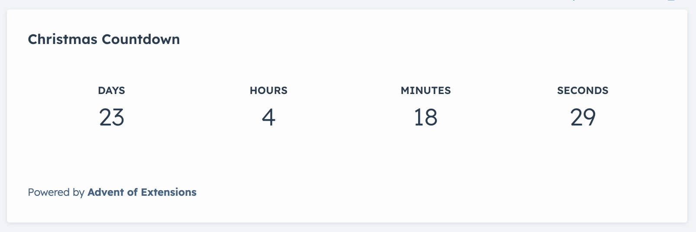
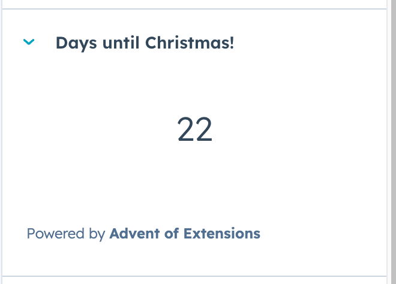
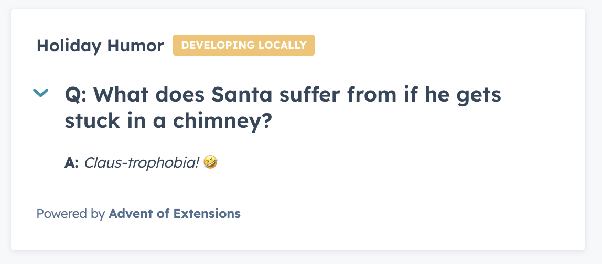
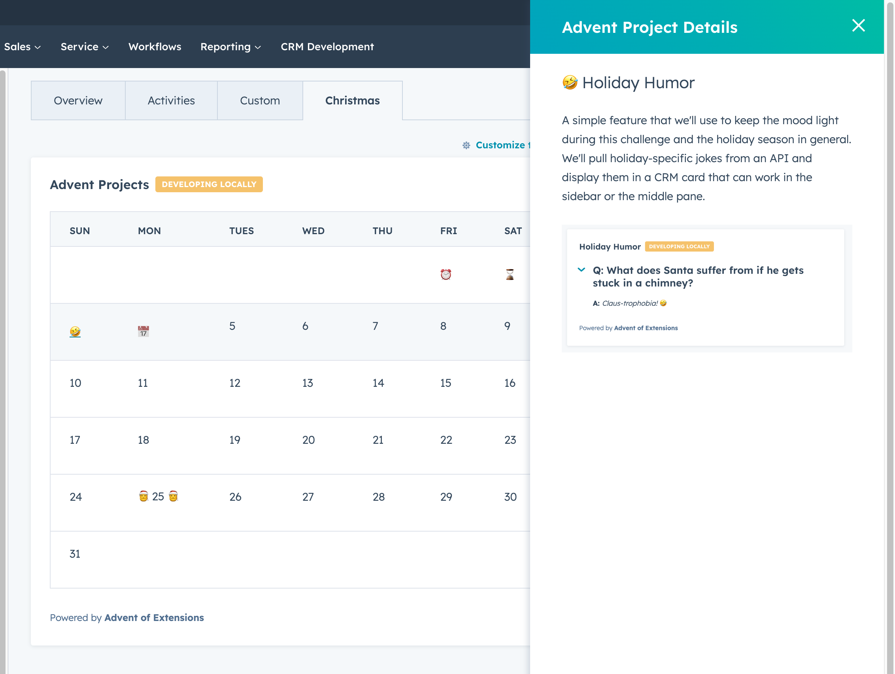

# The Advent of Extensions Challenge 2023

### Guidelines:
- Ship something every day for the first 25 days of December
- Does not need to be a totally new extension per day, but should useful addition
- Follow along with posted challenges, or do your own

### Day 1: Christmas Countdown

### Day 2: Compact Countdown

Our first feature is up! But it's a bit big for some users. We want to provide an option for them to install a more compact version of the card that can be used in the sidebar for a less in-your-face experience.

### Day 3: Holiday Humor

A simple feature that we'll use to keep the mood light during this challenge and the holiday season in general. We'll pull holiday-specific jokes from an API and display them in a CRM card that can work in the sidebar or the middle pane.

### Day 4: Advent Calendar View (so meta)

Today I'm going to take inspiration from what @sejal built during her first two days of the challenge: a pretty kick-ass calendar view of the days leading up the Christmas. However, rather than having this calendar serve as the countdown, I'm going to use it as a way to self-document each feature built per-day, and list them right on the calendar day entries themselves.

